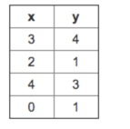

###### 一、Consider the problem of predicting how well a student does in her second year of college/university, given how well she did in her first year. Specifically, let x be equal to the number of "A" grades (including A-. A and A+ grades) that a student receives in their first year of college (freshmen year). We would like to predict the value of y, which we define as the number of "A" grades they get in their second year (sophomore year).Refer to the following training set of a small sample of different students' performances (note that this training set may also be referenced in other questions in this quiz). Here each row is one training example. Recall that in linear regression, our hypothesis is hθ(x)=θ0+θ1x, and we use m to denote the number of training examples.
 

###### For the training set given above, what is the value of m? In the box below, please enter your answer (which should be a number between 0 and 10).

##### answer：4

###### 二、For this question, assume that we are using the training set from Q1. Recall our definition of the cost function was What is J(0,1)? In the box below,please enter your answer (Simplify fractions to decimals when entering answer, and '.' as the decimal delimiter e.g., 1.5).

##### answer：0.5

###### 三、Suppose we set θ0=−1,θ1=0.5. What is hθ(4)?
#####answer：1

######四、Let f be some function so that f(θ0,θ1) outputs a number. For this problem,f is some arbitrary/unknown smooth function (not necessarily the cost function of linear regression, so f may have local optima).Suppose we use gradient descent to try to minimize f(θ0,θ1) as a function of θ0 and θ1. Which of the following statements are true? (Check all that apply.)
1. If θ0 and θ1 are initialized at a local minimum, then one iteration will not change their values. True
2. If θ0 and θ1 are initialized so that θ0=θ1, then by symmetry (because we do simultaneous updates to the two parameters), after one iteration of gradient descent, we will still have θ0=θ1.  False
3. Even if the learning rate α is very large, every iteration of gradient descent will decrease the value of f(θ0,θ1).  False
4. If the learning rate is too small, then gradient descent may take a very long time to converge.  True

######五、Suppose that for some linear regression problem (say, predicting housing prices as in the lecture), we have some training set, and for our training set we managed to find some θ0, θ1 such that J(θ0,θ1)=0.Which of the statements below must then be true? (Check all that apply.)

1. Gradient descent is likely to get stuck at a local minimum and fail to find the global minimum. False 
2. For this to be true, we must have θ0=0 and θ1=0 so that hθ(x)=0 False
3. For this to be true, we must have y(i)=0 for every value of i=1,2,…,m.  False 
4. Our training set can be fit perfectly by a straight line, i.e., all of our training examples lie perfectly on some straight line. True

